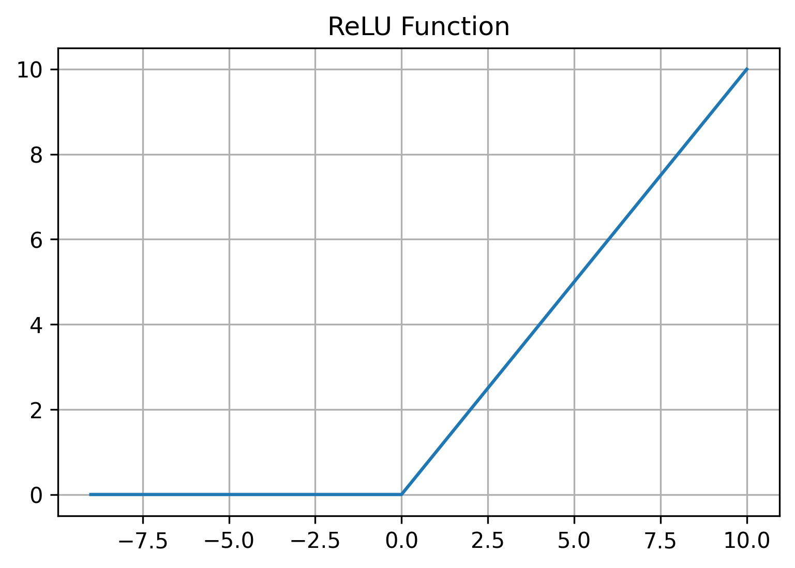
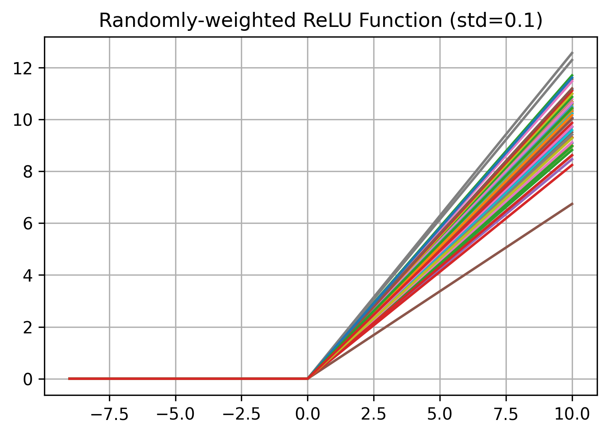

# randomly-weighted-ReLU

This repository explores the effects of assigning each neuron within a neural network a unique activation function, instead of using a uniform activation function. A non-uniform activation function means that neurons will produce different outputs, when subjected to the same input. This idea is inspired by a previous experiment, in which randomizing membrane parameters in spiking neural networks showed improved robustness when trained with backpropagation. The initial idea is inspired by the fact the biological neurons exhibit different types of firing behaviors.

The randomly-weighted ReLU activation function is just like a normal ReLU activation function:

but with an added weight term, that is set for each neuron during initialization:

The weight w is drawn from a normal distribution centered around zero and with a standard deviation of 0.1.

This figure shows the difference between a ReLU and a randomly-weighted ReLU activation function for a layer with 64 neurons:

 

